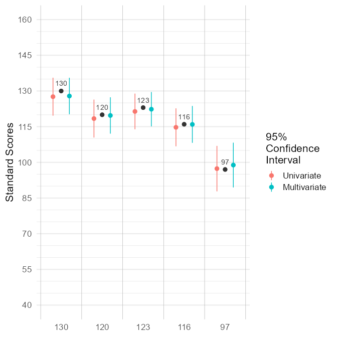

<!-- README.md is generated from README.Rmd. Please edit that file -->

# psycheval

<!-- badges: start -->
<!-- badges: end -->

The psycheval package is a set of functions that can be useful in
psychological evaluations. It accompanies the [*Individual
Psychometrics*](https://individual-psychometrics.rbind.io/) online
textbook.

## Installation

You can install the development version of psycheval like so:

``` r
remotes::install_github("wjschne/psycheval")
```

# Functions

## Convert a variable to standard scores

Suppose you have a scaled score of 12 (*μ* = 10, *σ* = 3) that you want
to convert to a standard score (*μ* = 100, *σ* = 15).

``` r
library(psycheval)
x2standard(12, mu_x = 10, sigma_x = 3)
#> [1] 110
```

To convert to a z-score (*μ* = 0, *σ* = 1):

``` r
x2standard(12,
           mu_x = 10, sigma_x = 3,
           mu_new = 0, sigma_new = 1)
#> [1] 0.67
```

To convert to T-score (*μ* = 50, *σ* = 10):

``` r
x2standard(12,
           mu_x = 10, sigma_x = 3,
           mu_new = 50, sigma_new = 10)
#> [1] 57
```

## Covariance of weighted sums

Let’s create a covariance matrix of 5 variables that all correlate at
.60.

``` r
# Create covariance matrix
Sigma <- matrix(0.6, nrow = 5, ncol = 5)
diag(Sigma) <- 1
Sigma
#>      [,1] [,2] [,3] [,4] [,5]
#> [1,]  1.0  0.6  0.6  0.6  0.6
#> [2,]  0.6  1.0  0.6  0.6  0.6
#> [3,]  0.6  0.6  1.0  0.6  0.6
#> [4,]  0.6  0.6  0.6  1.0  0.6
#> [5,]  0.6  0.6  0.6  0.6  1.0
```

Suppose we want to create a sum of the first 2 variables and a sum of
the remaining three variables. What would the covariance matrix of the
summary variables be?

First we create a weight matrix `w` with 5 rows and 2 columns consisting
entirely of zeros. The first column represents the weight for the first
variable. We put ones in the first two rows of the first column and ones
in rows 3–5 in the second column.

``` r
# Create weight matrix
w <- matrix(0, nrow = 5, ncol = 2)
w[1:2,1] <- 1
w[3:5,2] <- 1
w
#>      [,1] [,2]
#> [1,]    1    0
#> [2,]    1    0
#> [3,]    0    1
#> [4,]    0    1
#> [5,]    0    1
```

The covariance matrix of the sums is:

``` r
# covariance matrix of weighted sums
composite_covariance(Sigma, w)
#>      [,1] [,2]
#> [1,]  3.2  3.6
#> [2,]  3.6  6.6
```

To include the original variables in the covariance matrix, append an
identity matrix to `w`:

``` r
# A 5 by 5 idendity matrix
I <- diag(5)
I
#>      [,1] [,2] [,3] [,4] [,5]
#> [1,]    1    0    0    0    0
#> [2,]    0    1    0    0    0
#> [3,]    0    0    1    0    0
#> [4,]    0    0    0    1    0
#> [5,]    0    0    0    0    1

# Prepend the identity matrix to the w matrix
w_expanded <- cbind(diag(5), w)
w_expanded
#>      [,1] [,2] [,3] [,4] [,5] [,6] [,7]
#> [1,]    1    0    0    0    0    1    0
#> [2,]    0    1    0    0    0    1    0
#> [3,]    0    0    1    0    0    0    1
#> [4,]    0    0    0    1    0    0    1
#> [5,]    0    0    0    0    1    0    1

# Covariance matrix of original variables and the summary variables
BigSigma <- composite_covariance(Sigma, w_expanded)
BigSigma
#>      [,1] [,2] [,3] [,4] [,5] [,6] [,7]
#> [1,]  1.0  0.6  0.6  0.6  0.6  1.6  1.8
#> [2,]  0.6  1.0  0.6  0.6  0.6  1.6  1.8
#> [3,]  0.6  0.6  1.0  0.6  0.6  1.2  2.2
#> [4,]  0.6  0.6  0.6  1.0  0.6  1.2  2.2
#> [5,]  0.6  0.6  0.6  0.6  1.0  1.2  2.2
#> [6,]  1.6  1.6  1.2  1.2  1.2  3.2  3.6
#> [7,]  1.8  1.8  2.2  2.2  2.2  3.6  6.6

# Convert to correlations with the cov2cor function
composite_covariance(Sigma, w_expanded, correlation = T)
#>        [,1]   [,2]   [,3]   [,4]   [,5]   [,6]   [,7]
#> [1,] 1.0000 0.6000 0.6000 0.6000 0.6000 0.8944 0.7006
#> [2,] 0.6000 1.0000 0.6000 0.6000 0.6000 0.8944 0.7006
#> [3,] 0.6000 0.6000 1.0000 0.6000 0.6000 0.6708 0.8563
#> [4,] 0.6000 0.6000 0.6000 1.0000 0.6000 0.6708 0.8563
#> [5,] 0.6000 0.6000 0.6000 0.6000 1.0000 0.6708 0.8563
#> [6,] 0.8944 0.8944 0.6708 0.6708 0.6708 1.0000 0.7833
#> [7,] 0.7006 0.7006 0.8563 0.8563 0.8563 0.7833 1.0000
```

## Compute a multivariate confidence interval conditioned on a set of observed scores

``` r
library(readr)
library(ggplot2)
library(dplyr)
#> 
#> Attaching package: 'dplyr'
#> The following objects are masked from 'package:stats':
#> 
#>     filter, lag
#> The following objects are masked from 'package:base':
#> 
#>     intersect, setdiff, setequal, union

# Observed scores
x_wisc <- c(
  vci = 130,
  vsi = 120,
  fri = 123,
  wmi = 116,
  psi = 97)

# Reliability coefficients
rxx_wisc <- c(
  vci = .92,
  vsi = .92,
  fri = .93,
  wmi = .92,
  psi = .88)

# Correlation matrix
R_wisc <- ("
  index vci     vsi     fri     wmi     psi
  vci   1.00    0.59    0.59    0.53    0.30
  vsi   0.59    1.00    0.62    0.50    0.36
  fri   0.59    0.62    1.00    0.53    0.31
  wmi   0.53    0.50    0.53    1.00    0.36
  psi   0.30    0.36    0.31    0.36    1.00") |> 
  read_tsv(col_types = cols(
    .default = col_double(),
    index = col_character())) |> 
  tibble::column_to_rownames("index") |>
  as.matrix()
R_wisc
#>      vci  vsi  fri  wmi  psi
#> vci 1.00 0.59 0.59 0.53 0.30
#> vsi 0.59 1.00 0.62 0.50 0.36
#> fri 0.59 0.62 1.00 0.53 0.31
#> wmi 0.53 0.50 0.53 1.00 0.36
#> psi 0.30 0.36 0.31 0.36 1.00

d_ci <- multivariate_ci(
  x = x_wisc,
  rxx = rxx_wisc,
  mu = rep(100, 5),
  sigma = R_wisc * 225)

d_ci 
#>     score   x  rxx mu_univariate see_univariate mu_multivariate
#> vci   vci 130 0.92        127.60          4.069          127.88
#> vsi   vsi 120 0.92        118.40          4.069          119.70
#> fri   fri 123 0.93        121.39          3.827          122.33
#> wmi   wmi 116 0.92        114.72          4.069          115.95
#> psi   psi  97 0.88         97.36          4.874           98.86
#>     see_multivariate upper_univariate lower_univariate upper_multivariate
#> vci            3.912            135.6           119.62              135.5
#> vsi            3.897            126.4           110.42              127.3
#> fri            3.685            128.9           113.89              129.6
#> wmi            3.954            122.7           106.74              123.7
#> psi            4.803            106.9            87.81              108.3
#>     lower_multivariate
#> vci             120.21
#> vsi             112.07
#> fri             115.11
#> wmi             108.20
#> psi              89.44
```


